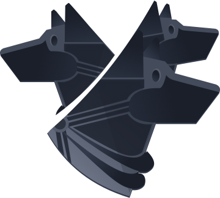

    

# THIS PROJECT IS NOT WORKING ATM. WIP.

## Quality assurance

To fix the basics of code format, you can run `go fmt ./...`.

For a bit more advanced code style checks, you can run `golint $(go list ./... | grep -v /vendor/)`. You'll have to run `go get -u golang.org/x/lint/golint` before.

## Dependencies upgrades

The dependendencies are automatically upgraded every Monday by Dependabot for both Javascript FrontEnd and Go Backend.

## License
